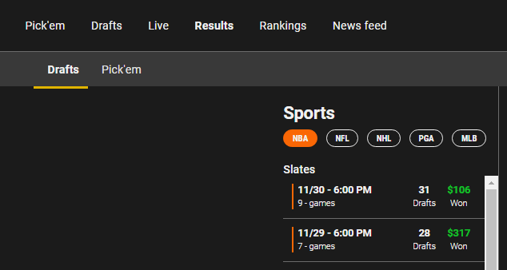
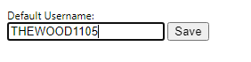

# UNDERDOG-RESULTS-EXTRACT

Extract your results from the "Results" page on the Underdog fantasy website for daily contests.

## Installation

1. To begin installation, you must ensure that "Developer mode" is enabled in your chrome extensions. To do this, navigate to `chrome://extensions/` in your browser, and click the toggle icon in the top right. You will also need a .zip file extractor, such as WinRAR or 7zip.

2. Download this repository as a .zip file. At the top of this page, there is a green button that says "Code". Click it, and select "Download ZIP" from the dropdown menu.

3. Open the downloaded .zip file, click into the folder that says `Underdog-Results-Extract-main`, then again into the `zip` folder. Select the .zip file and extract it somewhere on your computer.

4. Navigate back to `chrome://extensions/` in your browser. In your operating system's file explorer, select that .zip file you just extracted, then drag & drop it onto the chrome extension page. You should now see the extension on that page.

5. To use the extension, click the puzzle-piece looking icon in the top right of Google Chrome, and "pin" the extension. Once you see it in the list of extension icons.

## Usage

This tool is most utilized by Users that are drafting multiple teams at the same time. In the `Active` tab you can see each of your drafts, the player pool, you're queue and a scrolling draft board. You cannot see who you've currently drafted on that specific team unless you scroll through the draft board or you click on your username. This tool allows you to view the team just by selecting the draft on the left hand side of your window.

1. Log into your Underdog account on `www.UnderdogFantasy.com`.

2.

3. Enter as many drafts as you'd like.

3. Ensure `Drafts` is selected just below the heading.

4. Choose the sport you'd like to extract the results for. (Currently only NBA is tested, and known to be working)

5. Right click on the chrome extension icon and choose `Options`. A new tab will open with an input box.

6. Enter the date you'd like to get the extract up until. This must be in the same format as it's seen on the website. Click `Save`. You'll see a notification that you're settings have been updated.

Example:

If I want to gather the results for the 11/30 and 11/29 from the screenshot below step 4, here's what I'd enter.

7. Navigate back to the tab with your results and left click the chrome extension icon. You'll notice your page is looping through the tournaments and dates you've requested.

8. Once the process is finished a download box will appear, save the resulting CSV file wherever you'd like.

Example of resulting CSV file:

